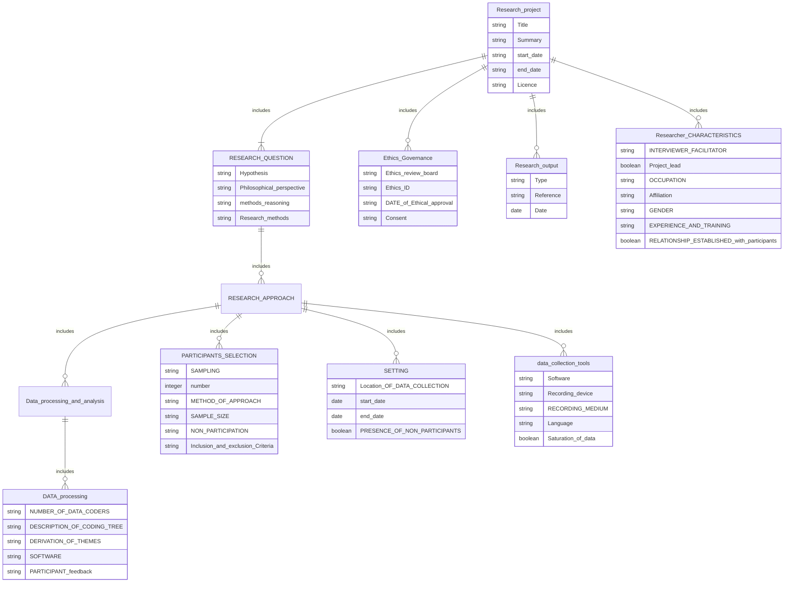

```mermaid
erDiagram
    Research_project  ||--|{ RESEARCH_QUESTION : includes
    Research_project  ||--o{ Ethics_Governance : includes
    Ethics_Governance {

        string Ethics_review_board

        string Ethics_ID

        string DATE_of_Ethical_approval
        string Consent


    }

    Research_project 
    {
        string Title
        string Summary
        string start_date
        string end_date
        
        string Licence
    }
    Research_project ||--o{ Research_output : includes
    Research_output   {
        string Type
        string Reference
        date Date
        
    }


    RESEARCH_QUESTION ||--o{ RESEARCH_APPROACH : includes

    RESEARCH_APPROACH ||--o{ Data_processing_and_analysis  : includes

 

    Research_project||--o{ Researcher_CHARACTERISTICS : includes

    Researcher_CHARACTERISTICS {

        string INTERVIEWER_FACILITATOR
        boolean Project_lead
        string OCCUPATION
        string Affiliation
        string GENDER
        string EXPERIENCE_AND_TRAINING
        boolean RELATIONSHIP_ESTABLISHED_with_participants

    }

 

    RESEARCH_QUESTION{
        string Hypothesis
        string Philosophical_perspective

        string methods_reasoning

        string Research_methods

    }

    RESEARCH_APPROACH ||--o{ PARTICIPANTS_SELECTION :includes   
        
    PARTICIPANTS_SELECTION {

        string SAMPLING
        integer number

        string METHOD_OF_APPROACH

        string SAMPLE_SIZE

        string NON_PARTICIPATION
        string Inclusion_and_exclusion_Criteria 

    }

 

    RESEARCH_APPROACH ||--o{ SETTING : includes
    SETTING {

        string Location_OF_DATA_COLLECTION
        date start_date
        date end_date
        boolean PRESENCE_OF_NON_PARTICIPANTS

    }
    
    RESEARCH_APPROACH ||--o{ data_collection_tools : includes
 
 data_collection_tools {

        string Software
        string Recording_device
        string RECORDING_MEDIUM
        string Language
        boolean Saturation_of_data
    }

    Data_processing_and_analysis ||--o{ DATA_processing : includes

    DATA_processing {

        string NUMBER_OF_DATA_CODERS

        string DESCRIPTION_OF_CODING_TREE

        string DERIVATION_OF_THEMES

        string SOFTWARE

        string PARTICIPANT_feedback

    }

```
