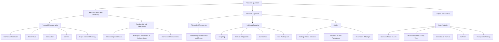

```mermaid
graph TD
    A[Research Question]-->B[Research Team and Reflexivity]
    A-->C[Research approach]
    A --> D[Analysis and Findings]
    B --> B1[Personal Characteristics]
    B1 --> B1a[Interviewer/Facilitator]
    B1 --> B1b[Credentials]
    B1 --> B1c[Occupation]
    B1 --> B1d[Gender]
    B1 --> B1e[Experience and Training]
    B --> B2[Relationship with Participants]
    B2 --> B2a[Relationship Established]
    B2 --> B2b[Participant Knowledge of the Interviewer]
    B2 --> B2c[Interviewer Characteristics]
    C --> C1[Theoretical Framework]
    C1 --> C1a[Methodological Orientation and Theory]
    C --> C2[Participant Selection]
    C2 --> C2a[Sampling]
    C2 --> C2b[Method of Approach]
    C2 --> C2c[Sample Size]
    C2 --> C2d[Non-Participation]
    C --> C3[Setting]
    C3 --> C3a[Setting of Data Collection]
    C3 --> C3b[Presence of Non-Participants]
    C3 --> C3c[Description of Sample]
    D --> D1[Data Analysis]
    D1 --> D1a[Number of Data Coders]
    D1 --> D1b[Description of the Coding Tree]
    D1 --> D1c[Derivation of Themes]
    D1 --> D1d[Software]
    D1 --> D1e[Participant Checking]
```
