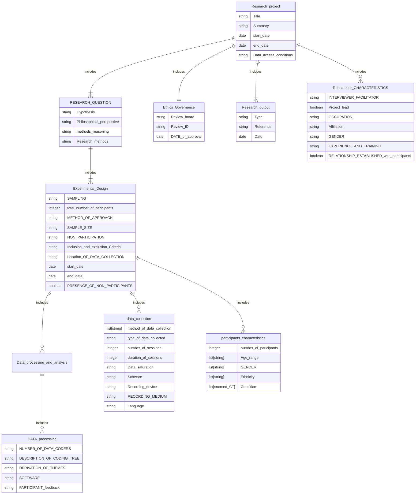

```mermaid
erDiagram
    Research_project  ||--|{ RESEARCH_QUESTION : includes
    Research_project  ||--|| Ethics_Governance : includes
    Ethics_Governance {

        string Review_board

        string Review_ID

        date DATE_of_approval


    }

    Research_project 
    {
        string Title
        string Summary
        date start_date
        date end_date
        string Data_access_conditions
        
    }
    Research_project ||--|{ Research_output : includes
    Research_output   {
        string Type
        string Reference
        date Date
        
    }


    RESEARCH_QUESTION ||--|{ Experimental_Design : includes

    Experimental_Design ||--o{ Data_processing_and_analysis  : includes

 

    Research_project||--o{ Researcher_CHARACTERISTICS : includes

    Researcher_CHARACTERISTICS {

        string INTERVIEWER_FACILITATOR
        boolean Project_lead
        string OCCUPATION
        string Affiliation
        string GENDER
        string EXPERIENCE_AND_TRAINING
        boolean RELATIONSHIP_ESTABLISHED_with_participants

    }

 

    RESEARCH_QUESTION {
        string Hypothesis
        string Philosophical_perspective

        string methods_reasoning

        string Research_methods

    }

    Experimental_Design {
        string SAMPLING
        integer total_number_of_paricipants
        string METHOD_OF_APPROACH
        string SAMPLE_SIZE
        string NON_PARTICIPATION
        string Inclusion_and_exclusion_Criteria
        string Location_OF_DATA_COLLECTION
        date start_date
        date end_date
        boolean PRESENCE_OF_NON_PARTICIPANTS
        

    }

    Experimental_Design ||--o{ data_collection : includes
    data_collection {
    list[string] method_of_data_collection
    string type_of_data_collected
    integer number_of_sessions
    integer duration_of_sessions
    string Data_saturation
    string Software
    string Recording_device
    string RECORDING_MEDIUM
    string Language
    }

    Experimental_Design ||--o{ participants_characteristics : includes
    participants_characteristics {
        integer number_of_paricipants
        list[string] Age_range
        list[string] GENDER
        list[string] Ethnicity
        list[snomed_CT] Condition
    }
    
 
    Data_processing_and_analysis ||--o{ DATA_processing : includes

    DATA_processing {

        string NUMBER_OF_DATA_CODERS

        string DESCRIPTION_OF_CODING_TREE

        string DERIVATION_OF_THEMES

        string SOFTWARE

        string PARTICIPANT_feedback

    }


```
